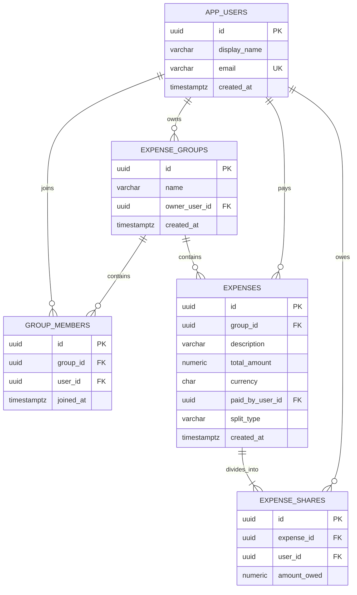

# Cost Split API

A backend MVP for a Splitwise-style cost-sharing application.

## Features

- Create and list users
- Create an expense group and add members
- Record who paid for an expense
- Divide an expense equally between selected participants
- Preserve the exact total when cents cannot divide evenly
- Calculate each member's net balance per currency
- Suggest repayments from debtors to creditors
- Serve requests with Kotlin suspending controllers and structured concurrency
- Validate the PostgreSQL schema with Flyway and Hibernate
- Return consistent RFC 9457 problem responses for API errors

Authentication, invitations, custom percentage splits, payment history, and notifications are intentionally outside this first version.

## Stack

- Java 17
- Kotlin 2.3.21
- Spring Boot 4.1.0
- Spring Web MVC, Validation, Data JPA, and Actuator
- PostgreSQL 17
- Flyway
- Gradle
- Kotlin Coroutines

## Database Design



`NUMERIC(19,2)` is used instead of floating point for money. An expense and its shares are saved in one transaction. Balances are never combined across currencies.

## Run Locally

Start PostgreSQL:

```bash
docker compose up -d
```

Run the API:

```bash
./gradlew bootRun
```

The API runs at `http://localhost:8080`. The health endpoint is `GET /actuator/health`.

These environment variables can override the local database settings:

```text
DATABASE_URL=jdbc:postgresql://localhost:5432/cost_split
DATABASE_USERNAME=cost_split
DATABASE_PASSWORD=cost_split
DATABASE_POOL_SIZE=10
```

## Concurrency Model

The REST controllers and services use Kotlin `suspend` functions. Blocking JPA/JDBC operations run on a bounded `Dispatchers.IO` view instead of occupying the servlet request thread. The dispatcher parallelism and Hikari connection pool share the `DATABASE_POOL_SIZE` setting, which defaults to `10`.

Independent balance reads use structured concurrency with `coroutineScope` and `async`. Transactional writes, such as creating an expense and all of its shares, stay sequential inside one database transaction so partial records cannot be committed.

JPA remains a blocking persistence technology. A fully non-blocking database stack would require replacing Spring MVC/JPA/JDBC with WebFlux and R2DBC; coroutines alone do not make JDBC non-blocking.

## API

| Method | Path | Purpose |
|---|---|---|
| `POST` | `/api/v1/users` | Create a user |
| `GET` | `/api/v1/users` | List users |
| `GET` | `/api/v1/users/{userId}` | Get a user |
| `POST` | `/api/v1/groups` | Create a group |
| `GET` | `/api/v1/groups/{groupId}` | Get a group and its members |
| `POST` | `/api/v1/groups/{groupId}/members` | Add an existing user |
| `POST` | `/api/v1/groups/{groupId}/expenses` | Create an equal-split expense |
| `GET` | `/api/v1/groups/{groupId}/expenses` | List group expenses |
| `GET` | `/api/v1/expenses/{expenseId}` | Get an expense and its shares |
| `GET` | `/api/v1/groups/{groupId}/balances` | Get balances and suggested repayments |

### Example Flow

Create two users:

```bash
curl -X POST http://localhost:8080/api/v1/users \
  -H 'Content-Type: application/json' \
  -d '{"displayName":"Sara","email":"sara@example.com"}'

curl -X POST http://localhost:8080/api/v1/users \
  -H 'Content-Type: application/json' \
  -d '{"displayName":"Reza","email":"reza@example.com"}'
```

Use the returned user IDs to create a group:

```bash
curl -X POST http://localhost:8080/api/v1/groups \
  -H 'Content-Type: application/json' \
  -d '{
    "name":"Weekend trip",
    "ownerUserId":"OWNER_USER_ID",
    "memberUserIds":["SECOND_USER_ID"]
  }'
```

Add an expense paid by one user and shared by both:

```bash
curl -X POST http://localhost:8080/api/v1/groups/GROUP_ID/expenses \
  -H 'Content-Type: application/json' \
  -d '{
    "description":"Dinner",
    "totalAmount":42.50,
    "currency":"USD",
    "paidByUserId":"OWNER_USER_ID",
    "participantUserIds":["OWNER_USER_ID","SECOND_USER_ID"]
  }'
```

Get the result:

```bash
curl http://localhost:8080/api/v1/groups/GROUP_ID/balances
```

A positive `netAmount` means the member should receive money. A negative value means the member owes money.

## Development

Run tests:

```bash
./gradlew test
```

The schema migration is in `src/main/resources/db/migration/V1__initial_schema.sql`. JPA uses `ddl-auto: validate`, so application startup fails early if entities and migrations drift apart.

## Deploy to Railway

1. Push this repository to GitHub.
2. In Railway, create a project and choose **Deploy from GitHub repo**.
3. Open the application service settings and set its root directory to `/backend`.
4. Add a PostgreSQL service to the same Railway project.
5. In the application service's **Variables** tab, add:

```text
DATABASE_URL=jdbc:postgresql://${{Postgres.PGHOST}}:${{Postgres.PGPORT}}/${{Postgres.PGDATABASE}}
DATABASE_USERNAME=${{Postgres.PGUSER}}
DATABASE_PASSWORD=${{Postgres.PGPASSWORD}}
```

If the database service has a different name, replace `Postgres` with that service name. Railway detects `backend/Dockerfile`, builds the application, and supplies the runtime `PORT` automatically.

6. Set the health-check path to `/actuator/health`.
7. In **Settings > Networking**, choose **Generate Domain**.

Flyway runs automatically when the deployed application starts. Do not expose PostgreSQL publicly unless an external database client genuinely needs it.
